R Data Science Chapter 1
================
Shaun Jackson

-   [Prerequisites](#prerequisites)
-   [3.2.4 Exercise Solutions](#exercise-solutions)
-   [3.3.1 Exercise Solutions](#exercise-solutions-1)
-   [3.5.1 Exercise Solutions](#exercise-solutions-2)

The below notes are from Hadley Wickham's R for Data Science.

My Notes are organized as follows:

1.  Exercise Solutions

2.  Summary of the chapter and my main takeaways

Prerequisites
=============

To start, we must make sure we have the **tidyverse** package loaded into our environment.

``` r
library(tidyverse)
```

Loading the tidyverse package will provide us with `mpg`, a tibble that will enable our analyses.

3.2.4 Exercise Solutions
========================

1.  Run `ggplot(data = mpg)`. What do you see?

    -   Running `ggplot(data = mpg)` produces not output that I can see. It looks like a blank graph.

2.  How many rows are in `mpg`? How many columns?

    -   There are 234 rows and 11 columns. (Used `nrow()` and `ncol()`).

3.  What does the `drv` variable describe?

    -   After `?mpg`, the values "f = front-wheel drive, r = rear wheel drive, 4 = 4wd". They describe a way to group the cars.

4.  Make a scatterplot of `hwy` vs `cyl`.

    ``` r
    ggplot(mpg, aes(x = hwy, y = cyl)) + geom_point()
    ```

    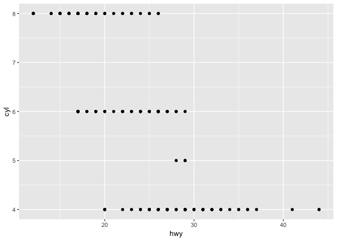

5.  What happens if you make a scatterplot? Why is the plot not useful?

    -   The plot is not useful because the scales of the coordinate axes and the points do not have any clear correlations.

3.3.1 Exercise Solutions
========================

1.  What's gone wrong with this code? Why are points not blue?

    ``` r
    ggplot(data = mpg) +
      geom_point(mapping = aes(x = displ, y = hwy, color = "blue"))
    ```

    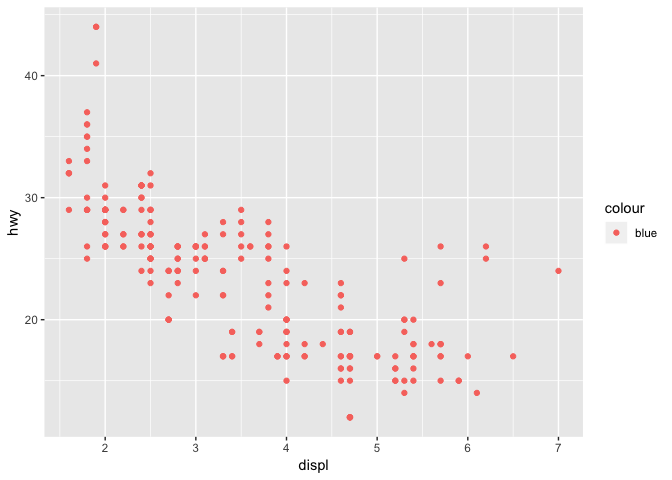

    -   The above code does not change the appearance of the plot. Instead, it changes the aesthetics layer of ggplot. To be more clear, the **value** of blue is assigned to all rows in the dataset, and being plotted with that characteristic. The appearance of the plot is not changed, the data is being processed, grouping all variables in the plot with a value of blue. In order to change the appearance, the data must **first** be plotted, and then the color can be assigned *outside* of the `aes()` function.

2.  Which variables in `mpg` are categorical? Which variables are continuous?

    -   The categorical variables in `mpg` are `model`, `year`, `cyl`, `trans`, `drv`, `fl`, and `class`.

3.  Map a continuous variable to `color`, `size`, and `shape`. How do these aesthetics behave differently for categorical vs. continuous variables?

    ``` r
    ggplot(mpg) + geom_point(aes(x = displ, y = hwy, color = cty))
    ```

    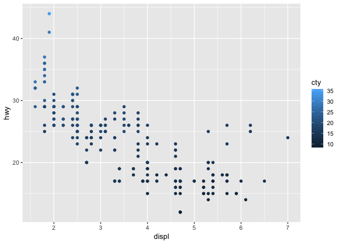

    ``` r
    ggplot(mpg) + geom_point(aes(x = displ, y = hwy, size = cty))
    ```

    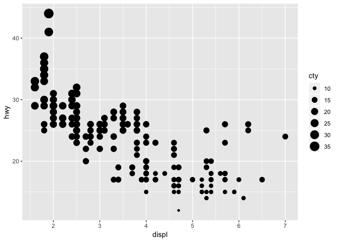

    -   inputting a continuous variable for `color` and `size` causes `ggplot` to define a *spectrum* of possible layers of colors and sizes. This is shown in the added legend of the graph.
    -   inputting a continuous variable for `shape` causes an error since there is no spectrum of shapes that can satisfy the amount of values in a continuous variable

4.  What happens if you map the same variable to multiple aesthetics?

    ``` r
    ggplot(mpg) + geom_point(aes(x = displ, y = displ, color = displ))
    ```

    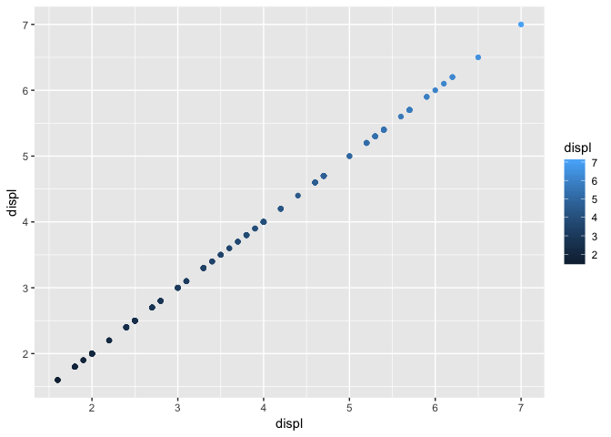

    -   ggplot will plot a graph with a slope of 1 since all variables have a 100% correlation.

5.  What does the `stroke` aesthetic do? What shapes does it work with? (Hint: use ?geom\_point)

    -   The stroke aesthetic helps degine the colour and fill in a ggplot.

6.  What happens if you map an aesthetic to something other than a variable name, like `aes(colour = displ < 5)`? Note, you’ll also need to specify x and y.

    ``` r
    ggplot(mpg) + geom_point(aes(x = displ, y = hwy, color = displ < 5))
    ```

    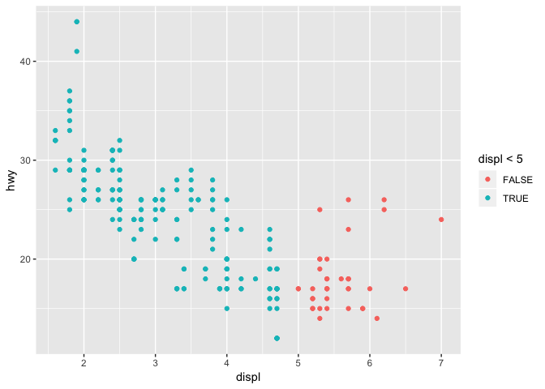

3.5.1 Exercise Solutions
========================

1.  What happens if you facet on a continuous variable?

    ``` r
    ggplot(data = mpg) + 
      geom_point(mapping = aes(x = displ, y = hwy)) + 
      facet_wrap(~ cty)
    ```

    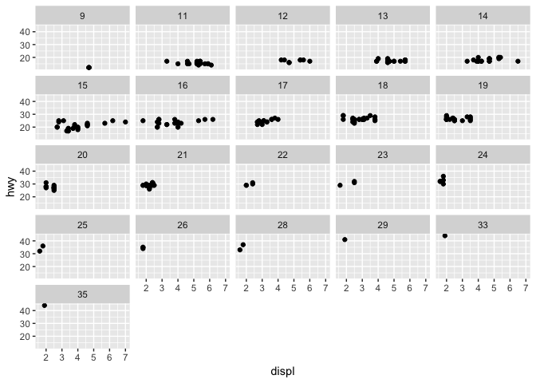

    -   ggplot will make subplots for every value the continuous variable has

2.  What do the empty cells in plot with facet\_grid(drv ~ cyl) mean? How do they relate to this plot?

    ``` r
    ggplot(data = mpg) + 
      geom_point(mapping = aes(x = drv, y = cyl))
    ```

    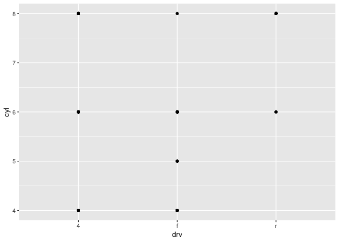

    -   The empty cells mean that there is no value for drv or cyl that exist for either variables within the facet\_grid.
    -   For the above plot, there is no point for the combination of drv and cyl in which an empty cell within the facet\_grid exists

3.  What plots does the following code make? What does . do?

    ``` r
    ggplot(data = mpg) + 
      geom_point(mapping = aes(x = displ, y = hwy)) +
        facet_grid(drv ~ .)
    ```

    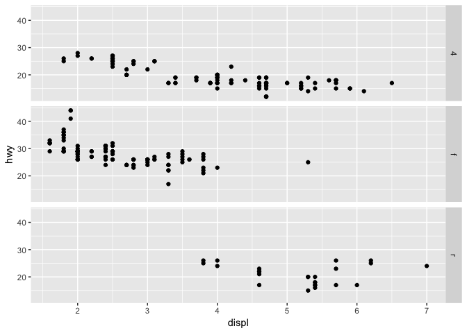

    ``` r
    ggplot(data = mpg) + 
      geom_point(mapping = aes(x = displ, y = hwy)) +
        facet_grid(. ~ cyl)
    ```

    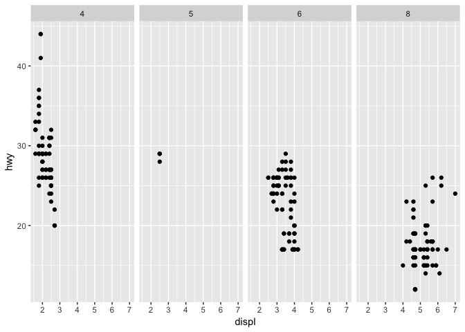

    -   The code above separates each facet within the grid individualling, in either row or column format. Depending on where the dot is, it will define if the subplots will be shown in row form, or in column form.

4.  Take the first faceted plot in this section:

    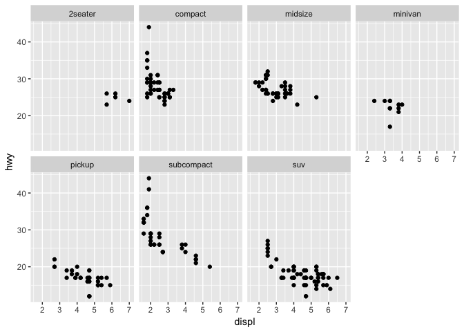

    -   What are the advantages to using faceting instead of the colour aesthetic? What are the disadvantages? How might the balance change if you had a larger dataset?

    -   The advantages are that you can more clearly distinguish what the subgroups are within a dataset, since there is a separate plot for each subgroup. A disadavantage could be that it would be harder to see the differences within a plot since the datapoints are in separate graphs. Faceting could me more advantageous than distinguishing by color with a larger dataset because this could dampen the effects of overplotting.

5.  Read ?facet\_wrap. What does nrow do? What does ncol do? What other options control the layout of the individual panels? Why doesn’t facet\_grid() have nrow and ncol arguments?

    -   nrow and ncol allow you to control the number of rows and columns on the ouput after facetting

6.  When using facet\_grid() you should usually put the variable with more unique levels in the columns. Why?

    -   Putting the variable with more unique levels in the columns allows one to more easily see the differences between changes from left to right, instead of from top to bottom.
