R Data Science Section 1
================
Shaun Jackson

-   [Prerequisites](#prerequisites)
-   [Chapter 3.2.4 Exercise Solutions](#chapter-3.2.4-exercise-solutions)
-   [Chapter 3.3.1 Exercise Solutions](#chapter-3.3.1-exercise-solutions)
-   [Chapter 3.5.1 Exercise Solutions](#chapter-3.5.1-exercise-solutions)
-   [Chapter 3.6.1 Exercise Solutions](#chapter-3.6.1-exercise-solutions)
-   [Chapter 3.7.1 Exercise Solutions](#chapter-3.7.1-exercise-solutions)
-   [Chapter 3.8.1 Exercise Solutions](#chapter-3.8.1-exercise-solutions)
-   [Chapter 3.9.1 Exercise Solutions](#chapter-3.9.1-exercise-solutions)
-   [Thoughts of Chapter](#thoughts-of-chapter)

The below notes are from Hadley Wickham's R for Data Science.

All numbered exercises are from the book.

My Notes are organized as follows:

1.  Exercise Solutions

2.  Summary of the chapter and my main takeaways

Prerequisites
=============

To start, we must make sure we have the **tidyverse** package loaded into our environment.

``` r
library(tidyverse)
```

Loading the tidyverse package will provide us with `mpg`, a tibble that will enable our analyses.

Chapter 3.2.4 Exercise Solutions
================================

1.  Run `ggplot(data = mpg)`. What do you see?

    -   Running `ggplot(data = mpg)` produces not output that I can see. It looks like a blank graph.

2.  How many rows are in `mpg`? How many columns?

    -   There are 234 rows and 11 columns. (Used `nrow()` and `ncol()`).

3.  What does the `drv` variable describe?

    -   After `?mpg`, the values "f = front-wheel drive, r = rear wheel drive, 4 = 4wd". They describe a way to group the cars.

4.  Make a scatterplot of `hwy` vs `cyl`.

    ``` r
    ggplot(mpg, aes(x = hwy, y = cyl)) + geom_point()
    ```

    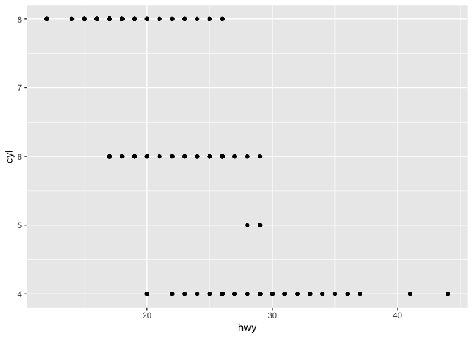

5.  What happens if you make a scatterplot? Why is the plot not useful?

    -   The plot is not useful because the scales of the coordinate axes and the points do not have any clear correlations.

Chapter 3.3.1 Exercise Solutions
================================

1.  What's gone wrong with this code? Why are points not blue?

    ``` r
    ggplot(data = mpg) +
      geom_point(mapping = aes(x = displ, y = hwy, color = "blue"))
    ```

    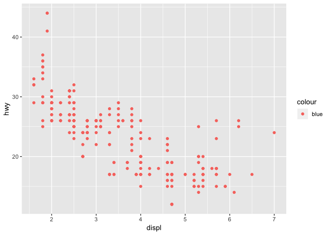

    -   The above code does not change the appearance of the plot. Instead, it changes the aesthetics layer of ggplot. To be more clear, the **value** of blue is assigned to all rows in the dataset, and being plotted with that characteristic. The appearance of the plot is not changed, the data is being processed, grouping all variables in the plot with a value of blue. In order to change the appearance, the data must **first** be plotted, and then the color can be assigned *outside* of the `aes()` function.

2.  Which variables in `mpg` are categorical? Which variables are continuous?

    -   The categorical variables in `mpg` are `model`, `year`, `cyl`, `trans`, `drv`, `fl`, and `class`.

3.  Map a continuous variable to `color`, `size`, and `shape`. How do these aesthetics behave differently for categorical vs. continuous variables?

    ``` r
    ggplot(mpg) + geom_point(aes(x = displ, y = hwy, color = cty))
    ```

    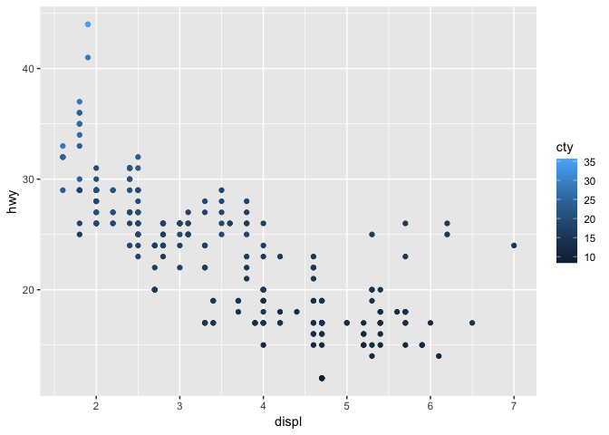

    ``` r
    ggplot(mpg) + geom_point(aes(x = displ, y = hwy, size = cty))
    ```

    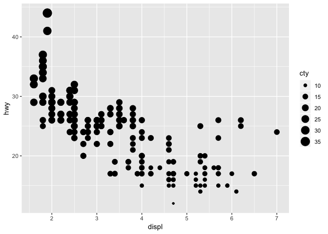

    -   inputting a continuous variable for `color` and `size` causes `ggplot` to define a *spectrum* of possible layers of colors and sizes. This is shown in the added legend of the graph.
    -   inputting a continuous variable for `shape` causes an error since there is no spectrum of shapes that can satisfy the amount of values in a continuous variable

4.  What happens if you map the same variable to multiple aesthetics?

    ``` r
    ggplot(mpg) + geom_point(aes(x = displ, y = displ, color = displ))
    ```

    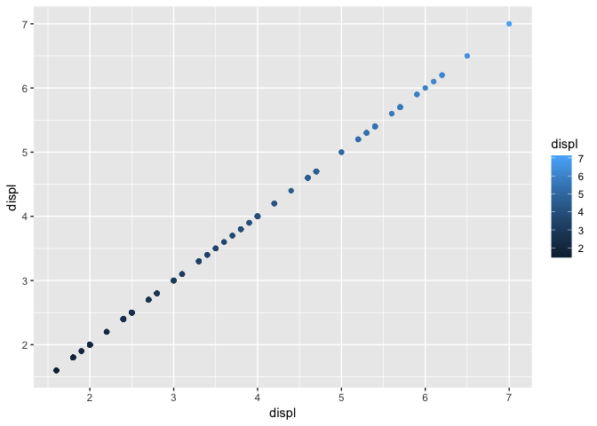

    -   ggplot will plot a graph with a slope of 1 since all variables have a 100% correlation.

5.  What does the `stroke` aesthetic do? What shapes does it work with? (Hint: use ?geom\_point)

    -   The stroke aesthetic helps degine the colour and fill in a ggplot.

6.  What happens if you map an aesthetic to something other than a variable name, like `aes(colour = displ < 5)`? Note, you’ll also need to specify x and y.

    ``` r
    ggplot(mpg) + geom_point(aes(x = displ, y = hwy, color = displ < 5))
    ```

    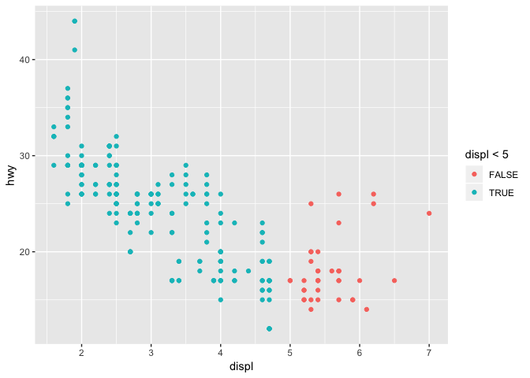

Chapter 3.5.1 Exercise Solutions
================================

1.  What happens if you facet on a continuous variable?

    ``` r
    ggplot(data = mpg) + 
      geom_point(mapping = aes(x = displ, y = hwy)) + 
      facet_wrap(~ cty)
    ```

    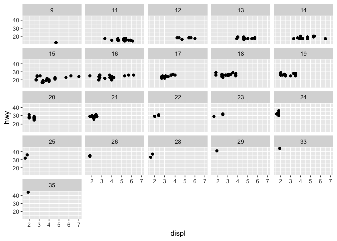

    -   ggplot will make subplots for every value the continuous variable has

2.  What do the empty cells in plot with facet\_grid(drv ~ cyl) mean? How do they relate to this plot?

    ``` r
    ggplot(data = mpg) + 
      geom_point(mapping = aes(x = drv, y = cyl))
    ```

    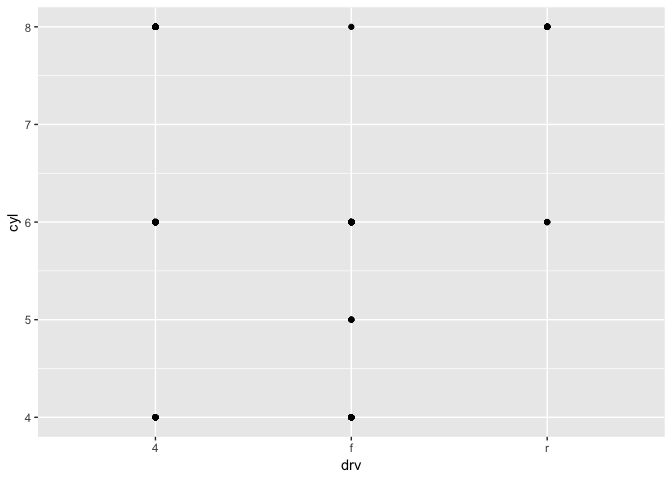

    -   The empty cells mean that there is no value for drv or cyl that exist for either variables within the facet\_grid.
    -   For the above plot, there is no point for the combination of drv and cyl in which an empty cell within the facet\_grid exists

3.  What plots does the following code make? What does . do?

    ``` r
    ggplot(data = mpg) + 
      geom_point(mapping = aes(x = displ, y = hwy)) +
        facet_grid(drv ~ .)
    ```

    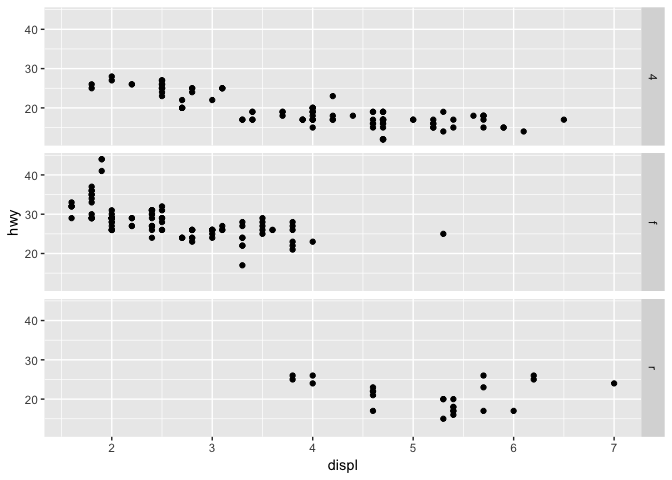

    ``` r
    ggplot(data = mpg) + 
      geom_point(mapping = aes(x = displ, y = hwy)) +
        facet_grid(. ~ cyl)
    ```

    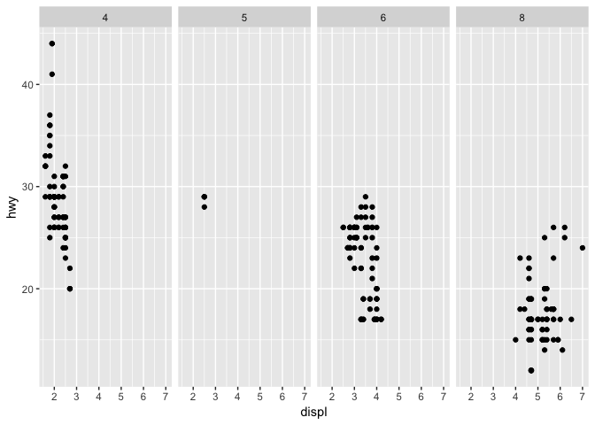

    -   The code above separates each facet within the grid individualling, in either row or column format. Depending on where the dot is, it will define if the subplots will be shown in row form, or in column form.

4.  Take the first faceted plot in this section:

    ``` r
    ggplot(data = mpg) + 
      geom_point(mapping = aes(x = displ, y = hwy)) + 
      facet_wrap(~ class, nrow = 2)
    ```

    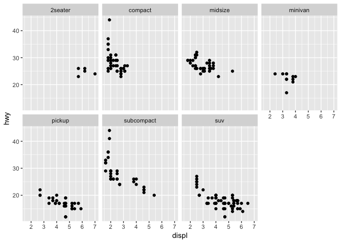

    -   What are the advantages to using faceting instead of the colour aesthetic? What are the disadvantages? How might the balance change if you had a larger dataset?

    -   The advantages are that you can more clearly distinguish what the subgroups are within a dataset, since there is a separate plot for each subgroup. A disadavantage could be that it would be harder to see the differences within a plot since the datapoints are in separate graphs. Faceting could me more advantageous than distinguishing by color with a larger dataset because this could dampen the effects of overplotting.

5.  Read ?facet\_wrap. What does nrow do? What does ncol do? What other options control the layout of the individual panels? Why doesn’t facet\_grid() have nrow and ncol arguments?

    -   nrow and ncol allow you to control the number of rows and columns on the ouput after facetting

6.  When using facet\_grid() you should usually put the variable with more unique levels in the columns. Why?

    -   Putting the variable with more unique levels in the columns allows one to more easily see the differences between changes from left to right, instead of from top to bottom.

Chapter 3.6.1 Exercise Solutions
================================

1.  What geom would you use to draw a line chart? A boxplot? A histogram? An area chart?

    -   I would use `geom_line(), geom_boxplot(), geom_histogram(), and geom_area()` for the above types of plots.

2.  Run this code in your head and predict what the output will look like. Then, run the code in R and check your predictions.

    ``` r
    ggplot(data = mpg, mapping = aes(x = displ, y = hwy, color = drv)) + 
      geom_point() + 
        geom_smooth(se = FALSE)
    ```

    

    -   Prediction: The output will provide a plot with both data points and a smooth line. The color of the data points / the line will be dependent on the value of drv.

    ``` r
    ggplot(data = mpg, mapping = aes(x = displ, y = hwy, color = drv)) + 
      geom_point() + 
        geom_smooth(se = FALSE)
    ```

    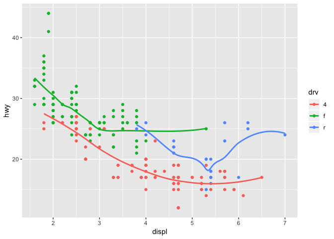

3.  What does show.legend = FALSE do? What happens if you remove it? Why do you think I used it earlier in the chapter?

    -   `show.legend=FALSE` causes ggplot to not show a legend on the graph. It was used earlier in the chapter in order to make the plots appear more clean.

4.  What does thev`se` argument to `geom_smooth()` do?

    -   It allows the user to choose whether or not they want to display the confidence interval around smooth.

5.  Will these two graphs look different? Why/why not?

    -   The two graphs will not look different because the first graph sets the global options as shown in the second graph.

6.  Recreate the R code necessary to generate the following graphs.

    ``` r
    ggplot(mpg, aes(x = displ, y = hwy)) + 
      geom_point(size = 4) +
        geom_smooth(se = FALSE)
    ```

    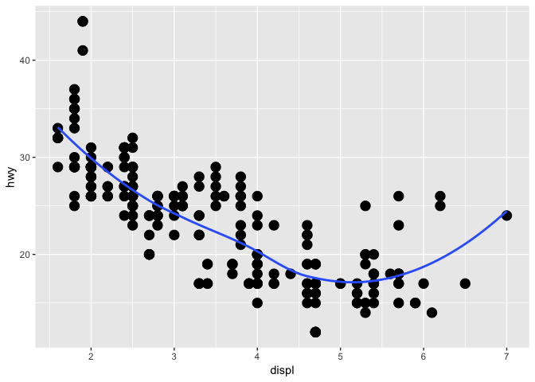

    ``` r
    ggplot(mpg, aes(x = displ, y = hwy, group = drv)) + 
      geom_point(size = 4) +
        geom_smooth(se = FALSE)
    ```

    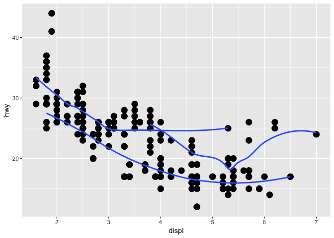

    ``` r
     ggplot(mpg, aes(x = displ, y = hwy, color = drv)) + 
      geom_point(size = 4) +
        geom_smooth(se = FALSE, size = 2)
    ```

    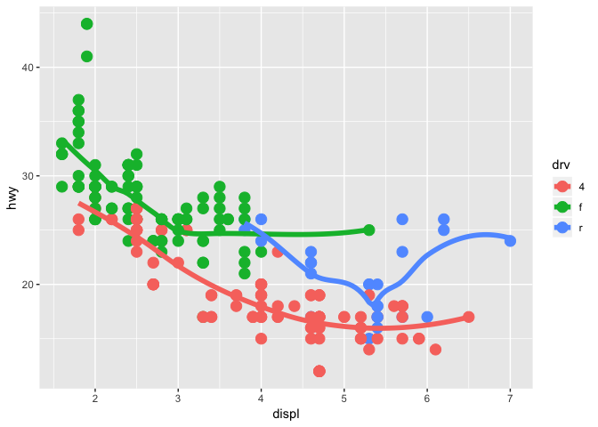

    ``` r
     ggplot(mpg, aes(x = displ, y = hwy)) + 
      geom_point(size = 3, aes(color = drv)) +
        geom_smooth(se = FALSE, size = 2)
    ```

    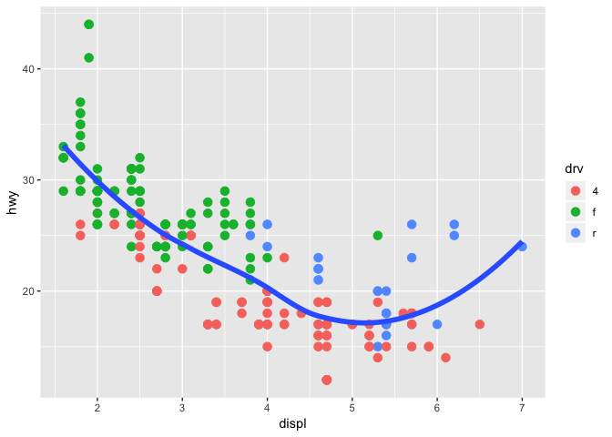

    ``` r
     ggplot(mpg, aes(x = displ, y = hwy)) + 
      geom_point(size = 3, aes(color = drv)) +
        geom_smooth(se = FALSE, size = 1, aes(linetype = drv))
    ```

    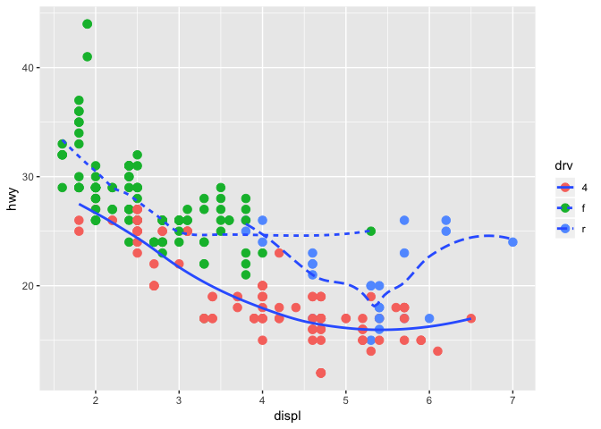

    ``` r
     ggplot(mpg, aes(x = displ, y = hwy)) + 
      geom_point(size = 4, color = "white") +
       geom_point(aes(colour = drv))
    ```

    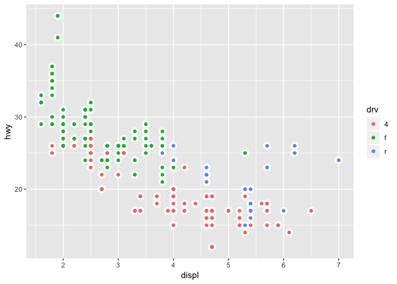

    -   The last one was tricky, but I forgot that you could add two geom\_points().

Chapter 3.7.1 Exercise Solutions
================================

1.  What is the default geom associated with stat\_summary()? How could you rewrite the previous plot to use that geom function instead of the stat function?

    -   The default geom is "pointrange". You could rewrite it as

    ``` r
    ggplot(diamonds) +
      geom_pointrange(mapping = aes(x = cut, y = depth), 
                      stat = "summary",
                      fun.ymin = min,
                      fun.ymax = max,
                      fun.y = median)
    ```

    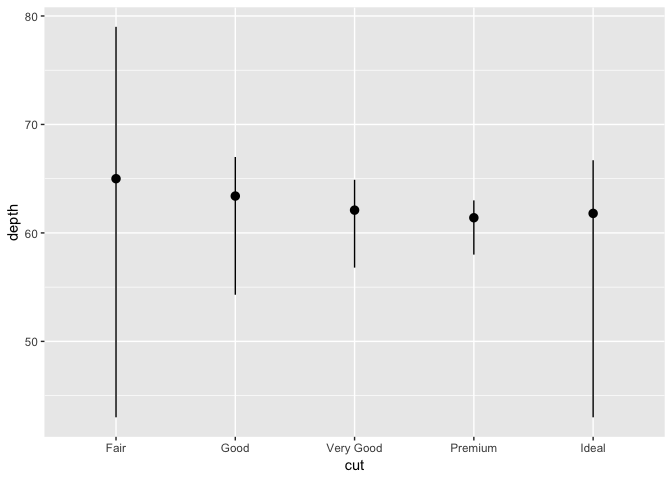

    -   By changing the default stat to summary, it replicates the plot of stat\_summary() since stat\_summary has a default geom of geom\_pointrange().

2.  What does geom\_col() do? How is it different to geom\_bar()?

    -   Running `?geom_col`, it appears that geom\_col uses `stat_identity()` as default whereas `geom_bar()` uses `stat_count()` as default. So, `geom_col` does not add in a count variable, it maps an x value to a y value that already exists in the dataframe.

3.  Most geoms and stats come in pairs that are almost always used in concert. Read through the documentation and make a list of all the pairs. What do they have in common?

    1.  `stat_bin` to `geom_freqpoly`
    2.  `stat_bin2d` to `geom_bind2d`
    3.  `stat_binhex` to `geom_hex`
    4.  `stat_boxplot` to `geom_boxplot`
    5.  `stat_smooth` to `geom_smooth`

    -   Still need to reference all pairs (there are a ton)

    -   What they have in common are that they both have similar names, one starts with stat, and the other starts with geom, ending with what they do. Still need to research more on this.

4.  What variables does stat\_smooth() compute? What parameters control its behaviour?

    -   It uses the same arguments as `geom_smooth`. A list of parameters that control its behavior can be found with `?stat_smooth`.

5.  In our proportion bar chart, we need to set group = 1. Why? In other words what is the problem with these two graphs?

    ``` r
    ggplot(data = diamonds) + 
      geom_bar(mapping = aes(x = cut, y = ..prop..))
    ```

    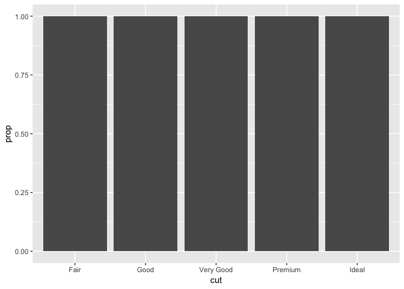

    ``` r
    ggplot(data = diamonds) + 
      geom_bar(mapping = aes(x = cut, fill = color, y = ..prop..))
    ```

    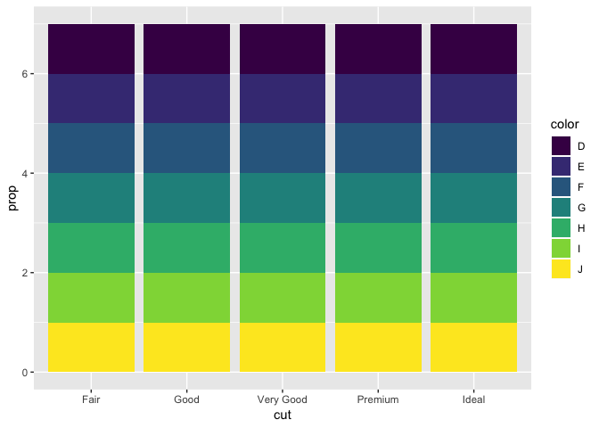

    -   Running `?geom_bar`,
        -   "Geom\_bar() makes the height of the bar proportional to the number of cases in each group.""
    -   Therefore, every group (fair, good, etc., is its own group. So, 100% of the cases are being counted.) For example, for the group "Fair", say there were 35 cases with Fair. The bar plot is plotting 35/35 cases, that is why the proportion is at 100%. By setting the group = 1, it will sum the total of all "Fair", "Good", etc. and divide each individual group by the total.

Chapter 3.8.1 Exercise Solutions
================================

1.  What is the problem with this plot? How could you improve it?

    ``` r
    ggplot(data = mpg, mapping = aes(x = cty, y = hwy)) + 
      geom_point()
    ```

    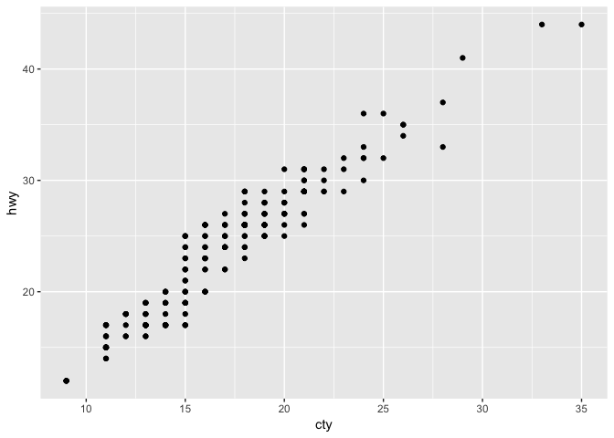

    -   There is some overplotting in the above plot. Using `jitter` will fix this.

    ``` r
    ggplot(data = mpg, mapping = aes(x = cty, y = hwy)) + 
      geom_point(position = "jitter")
    ```

    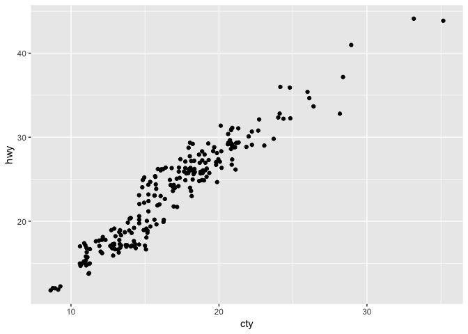

2.  What parameters to geom\_jitter() control the amount of jittering?

    -   `?geom_jitter` points out that the width and height parameters control the ammount of jittering.

3.  Compare and contrast geom\_jitter() with geom\_count().

    -   geom\_point counts the number of observations at each location and then maps this count to the point area whereas geom\_jitter adds randomness to each point in order to help visualize overplotted data.

4.  What’s the default position adjustment for geom\_boxplot()? Create a visualisation of the mpg dataset that demonstrates it.

    -   The default position adjustment is "dodge2".

    ``` r
    ggplot(mpg, aes(x = trans)) + geom_boxplot(aes(y = hwy))
    ```

    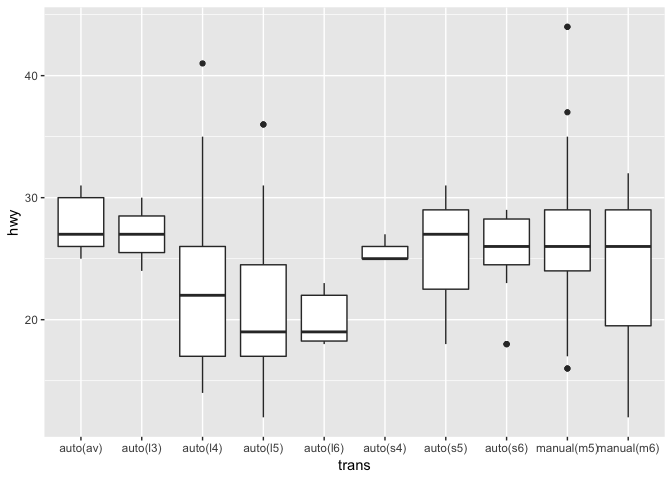

Chapter 3.9.1 Exercise Solutions
================================

1.  Turn a stacked bar chart into a pie chart using coord\_polar().

    ``` r
    bar <- ggplot(data = mpg) + 
      geom_bar(
      mapping = aes(x = cyl, fill = cyl), 
      show.legend = FALSE,
      width = .5
      ) + 
        theme(aspect.ratio = 1) +
          labs(x = NULL, y = NULL)
    bar + coord_cartesian()
    ```

    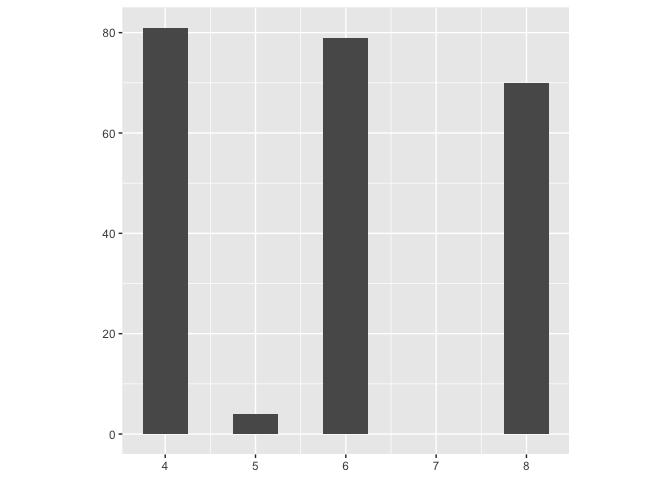

    ``` r
    bar + coord_polar()
    ```

    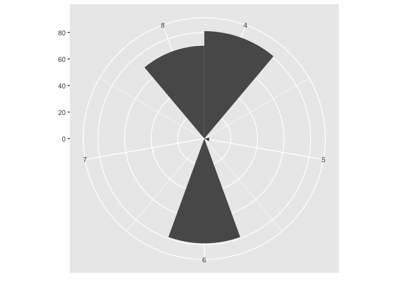

2.  What does `labs()` do? Read the documentation.

    -   It allows one to modify the axis, legend and plot labels within ggplot2

3.  What’s the difference between coord\_quickmap() and coord\_map()?

    -   Run `?coord_map` to see answer.

4.  What does the plot below tell you about the relationship between city and highway mpg? Why is coord\_fixed() important? What does geom\_abline() do?

    ``` r
    ggplot(data = mpg, mapping = aes(x = cty, y = hwy)) +
      geom_point() + 
      geom_abline() +
      coord_fixed()
    ```

    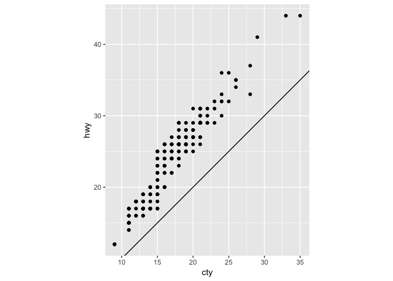

    -   As cty increases, mpg also increases. Coord\_fixed "forces a specified ratio between the physical representation of data units on the axes" - `?coord_fixed`

    -   geom\_abline addes a reference line to a plot.

Thoughts of Chapter
===================

I thought that this chapter was a very well structured tutorial of how ggplot works. I remember trying to use ggplot for previous data visualization projects, and it was very difficult figuring out how to use it without reading much about it. My main takeaways from this chapter was the aesthetic mappings section, and grouping variables within dataframes by color or by lines. I also enjoyed learning about the statistical transformations, since that used to confuse me in the past.
